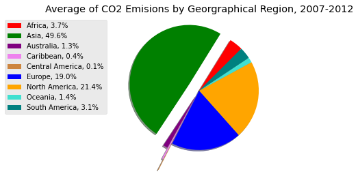
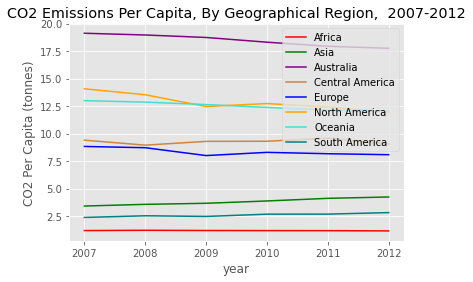
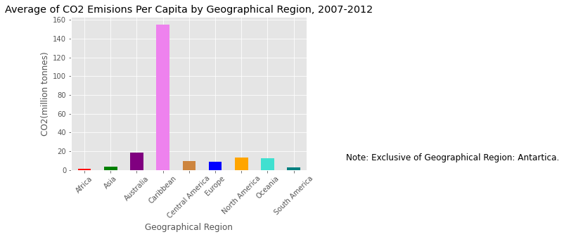

# World Events _&_ Carbon Emissions 

## Overview
Carbon Emissions are in part, one of the greatest contributors to Global Warming. 
Despite the signing of The Paris Agreement in 2015, an international treaty on climate change, carbon emissions, as well as, temperatures are notably, _still_ rising. 

However, since the Coronavirus (COVID-19) Pandemic, starting 2020, it has been reported from the [International Energy Agency (IEA)]( https://www.iea.org/reports/global-energy-review-2021/co2-emissions), CO2 emissions have fallen about 6%.  

But, in seesaw-like fashion emissions are set to rebound to record heights as the world slowly “re-opens”, reaching to nearly 5% by the end of 2021. The former will be the second highest recorded increase in CO2 emissions since 2010, when the world was effectively, in recovery from the Great Recession (2007 - 2009). 

**Purpose:**

In reviewing various articles and data sources, with regards to carbon emissions, conclusive, multiple revolving themes presented. 

_That is…_

(1)	carbon emissions are driven by various factors like per capita and Gross Domestic Product (GDP); 

(2)	carbon emissions undeniable vary from geographical region, industry, and sector;

(3)	carbon emissions by type, i.e., coal, oil and gas, will, too, vary in “popularity” across regions;

(4)	and the “state” of the region in which carbon emissions are present, also play a part of significance. 

Of late, the world is experiencing, aforementioned, a pandemic.   Records indicate, at first glance, a rather interesting correlation between the “state” of the world and the emission of CO2, by which will be furthered explored in this analysis. 

#

## Areas of Focus 

**Carbon Emissions and World Events:**

 * How are carbon emissions affected during times of world events, i.e., global recessions, pandemic, conflict)?
 *  Is there a direct correlation with Carbon Emissions and Economic success, specifically?

**Specific Considerations**
* Carbon Emissions by Geographical Region
* Time Period 2007 -2012
* World Events:
    * Global Recession 2007-2009
    * Economic Crisis of 2012
#

## Data Source
Analysis was conducted from dataset sourced from [Our World Data](https://github.com/owid/co2-data). 

Dataset provided a substantial set of global carbon emission records dating back to 1750. 

#
## Dashboard
** Visualization: ** Matplotlib

insert images (share link of image folder)
[Tableau](insert link) 
#

## Results/Findings

Is there a correlation between carbon emission activity and world events? _Yes._ 

More deeply, carbon emissions are at the helm, derived from human behaviors. If human behaviors are impacted, or a changed due to extenuating circumstances, such as an economic collapse, a vow to reduce carbon footprint, emissions will, also,  undeniably be affected. 

**What else the analysis revealed?**

**Carbon Emissions Overall**

The top 3 Emitters of CO2 Emissions during 2007-2012, were **Asisa** , **North America**, and **Europe**

  

**Highest Carbon Emissions Per Capita**

**Australia** and **Carribean** tends to lean towards having the highest emissions per capita during this time period

 

  

  

**Central America**
**Central America's** emissions increased in 2009 and remained the following year. 

**Oceania**
**Oceania** illustrasted a steady decline since 2007. 

**Africa**
**Africa** carbon emissions was noticably strong in 2008. 

## Presentation
 Final presentation can be viewed, [here](final/presentation/world_events_emissions_wdg_fp_pres.pdf).
#

## Database

 **Relational Database: PostgreSQL**

    **Initial Stages** → Source Data → **Next Stage** → EDA: Review, Clean Data, Create Schema→ **Last Stage** →   Import, Store Data in Database, via Pandas

[Entity Relationship Diagram (ERD)](final/resources/schema/ERD_world_events_carbon_df_fp.png)

[Database](final/resources/schema/decades_co_emissions_schema_fp_wdg_data_loaded.png)

[Schema](final/resources/schema/world_events_carbon_schema_fp_wdg.sql)

#
## Machine Learning Model: Popular Carbon Emissions Type
 In the next iteration this analysis 
#

## Methods & Tools 
PostgreSQL 11, pgAdmin 4 v 5 | Python, Python Libaries: Pandas, Mathplotlib, SQLAlchemy, Psycopg2 | VS Code 1.54.3, Microsoft Excel, PowerPoint | Jupyter Notebook** 
 
* Data Access: Workaround, [Project Jupyter: jupyter nbviewer](https://nbviewer.jupyter.org/), a Jupyter Notebook renderer **
     * Data may not display properly on GitHub, please use provided workaround
 
#
## References
 
An extensive list of reference  used during this analysis can be found within the ["resources"](final/resources/sources_ref_wdg_fp.pdf) folder directory. 

---
### Author
Whitney D. Gardner || April/May 2021